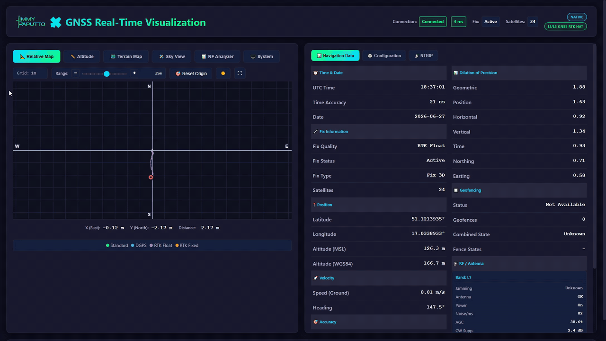

# Gnsshat Library

| Branch | Debian | Pi 4 | Pi 5 |
|--------|--------|------|------|
| `master` | [](https://github.com/jimmypaputto/gnssHat/actions/workflows/generic-ci.yml) | [](https://github.com/jimmypaputto/gnssHat/actions/workflows/pi4-ci.yml) | [](https://github.com/jimmypaputto/gnssHat/actions/workflows/pi5-ci.yml) |
| `develop` | [](https://github.com/jimmypaputto/gnssHat/actions/workflows/generic-ci.yml) | [](https://github.com/jimmypaputto/gnssHat/actions/workflows/pi4-ci.yml) | [](https://github.com/jimmypaputto/gnssHat/actions/workflows/pi5-ci.yml) |

Driver library for Jimmy Paputto GNSS HATs on Raspberry Pi. Handles the full u-blox UBX protocol and provides a high-level API in C++, C and Python. Buy our HATs at [jimmypaputto.com](https://jimmypaputto.com) - if you have custom u-blox hardware, most of the code will still be useful.

## Web Application



The library ships with a ready-to-run **real-time web dashboard** (Flask + Socket.IO). Run it on the Raspberry Pi and open it from any device on your network - phone, laptop, tablet - no extra software needed:

- **Relative map & altitude tape** - centimeter-grade position and altitude offsets from a reference point, with grid down to 1 cm on RTK fixed.
- **Terrain map** - live position on OpenStreetMap.
- **Sky view** - polar satellite plot color-coded by constellation (GPS, Galileo, GLONASS, BeiDou, SBAS, QZSS) plus a tracked-satellite table.
- **RF analyzer** - live spectrum (MON-SPAN) with jamming, AGC and noise indicators (MON-RF).
- **Navigation panel & config editor** - full fix data and live module reconfiguration straight from the browser.
- **Three data sources** - the GnssHat library directly (SPI), a serial NMEA port, or ROS 2 topics.

> **More info:** see the [visualization README](examples/visualization/README.md) for setup, operating modes and a full feature list.

## Supported Hardware

The library auto-detects the HAT variant via `/proc/device-tree/hat/product`.

| HAT | u-blox Module | Interface | USB | RTK | Time Base | Time Mark | Geofencing |
|-----|---------------|-----------|-----|-----|-----------|-----------|------------|
| L1 GNSS HAT | NEO-M9N | SPI | Yes | -- | -- | -- | Up to 4 zones |
| L1/L5 GNSS TIME HAT | NEO-F10T | UART | -- | -- | Survey-In / Fixed Position | EXTINT GPIO 17 | -- |
| L1/L5 GNSS RTK HAT | NEO-F9P | SPI + UART | Yes | Base & Rover | -- | -- | Up to 4 zones |

## Installation

### Dependencies

```sh
sudo apt-get install build-essential cmake libgpiod-dev
```

For Python bindings you also need:

```sh
sudo apt-get install python3-dev
```

For CLI tools (`gnsshat-rtk-base`) you also need **toml11** (TOML config parser):

```sh
# If packaged on your distro:
sudo apt-get install libtoml11-dev

# Or install from source:
git clone https://github.com/ToruNiina/toml11.git -b v4.2.0
cd toml11
cmake -B build
sudo cmake --install build
```

### Build & install

```sh
git clone https://github.com/jimmypaputto/gnsshat.git
cd gnsshat
mkdir -p build && cd build
cmake .. -DBUILD_PYTHON=ON -DBUILD_EXAMPLES=ON
make -j$(nproc)
sudo make install
```

> `make -j$(nproc)` builds in parallel using all cores
> If you run low on RAM, lower it (e.g. `make -j2`).

| Flag | Default | Description |
|------|---------|-------------|
| `BUILD_PYTHON` | OFF | Build and install the Python CPython extension module |
| `BUILD_EXAMPLES` | OFF | Build all C and C++ examples. Binaries are symlinked into `examples/bin/` for convenience |
| `BUILD_TOOLS` | OFF | Build CLI tools (`gnsshat-info`, `gnsshat-probe`, `gnsshat-rtk-base`). Requires toml11 |
| `BUILD_TESTS` | OFF | Build unit tests (requires GTest). Run with `ctest` |

All flags are optional.

### Build/First run troubleshooting

```sh
[UART] Failed to open UART device: No such file or directory
[UART] Cannot init epoll - UART not initialized
```
It likely means that UART on the rpi is disabled/busy or configured differently. You might want to enable it for development use via raspi-config if you're using hat that requires it.

```sh
/home/pi/GnssHat/src/common/GpioInterruptLine.cpp:160:9: error: ‘gpiod_edge_event_buffer_free’ was not declared in this scope; did you mean ‘gpiod_edge_event_buffer’?
```
That is due to the wrong version of libgpiod specified in the CMakeLists.txt. Set the version to 1 or 2, depending on your setup:
```sh
set(LIBGPIOD_VERSION 1)
or
set(LIBGPIOD_VERSION 2)
```
For most recent rpi images that would be version 2.

## Quick Start

### C++

```cpp
#include <cstdio>
#include <jimmypaputto/GnssHat.hpp>

using namespace JimmyPaputto;

auto main() -> int
{
    auto* hat = IGnssHat::create();
    hat->softResetUbloxSom_HotStart();

    GnssConfig config {
        .measurementRate_Hz = 1,
        .dynamicModel = EDynamicModel::Stationary,
        .timepulsePinConfig = TimepulsePinConfig {
            .active = true,
            .fixedPulse = { .frequency = 1, .pulseWidth = 0.1f },
            .pulseWhenNoFix = std::nullopt,
            .polarity = ETimepulsePinPolarity::RisingEdgeAtTopOfSecond
        },
        .geofencing = std::nullopt,
        .rtk = std::nullopt,
        .timing = std::nullopt
    };

    if (!hat->start(config))
    {
        printf("Failed to start GNSS\n");
        return -1;
    }

    while (true)
    {
        const auto nav = hat->waitAndGetFreshNavigation();
        printf("%.6f, %.6f  alt=%.1fm  sats=%d\n",
            nav.pvt.latitude, nav.pvt.longitude,
            nav.pvt.altitude, nav.pvt.visibleSatellites);
    }
}
```

### Python

```python
from jimmypaputto import gnsshat

hat = gnsshat.GnssHat()
hat.soft_reset_hot_start()

config = {
    'measurement_rate_hz': 1,
    'dynamic_model': gnsshat.DynamicModel.PORTABLE,
    'timepulse_pin_config': {
        'active': True,
        'fixed_pulse': { 'frequency': 1, 'pulse_width': 0.1 },
        'polarity': gnsshat.TimepulsePolarity.RISING_EDGE
    },
    'geofencing': None
}

if not hat.start(config):
    print("Failed to start GNSS")
    exit(1)

while True:
    nav = hat.wait_and_get_fresh_navigation()
    print(nav)
```

### C

```c
#include <stdio.h>
#include <jimmypaputto/GnssHat.h>

int main(void)
{
    jp_gnss_hat_t* hat = jp_gnss_hat_create();
    jp_gnss_hat_soft_reset_hot_start(hat);

    jp_gnss_gnss_config_t config;
    jp_gnss_gnss_config_init(&config);
    config.measurement_rate_hz = 1;
    config.dynamic_model = JP_GNSS_DYNAMIC_MODEL_STATIONARY;
    config.timepulse_pin_config.active = true;
    config.timepulse_pin_config.fixed_pulse.frequency = 1;
    config.timepulse_pin_config.fixed_pulse.pulse_width = 0.1f;
    config.timepulse_pin_config.polarity = JP_GNSS_TIMEPULSE_POLARITY_RISING_EDGE;

    if (!jp_gnss_hat_start(hat, &config))
    {
        printf("Failed to start GNSS\n");
        jp_gnss_hat_destroy(hat);
        return -1;
    }

    jp_gnss_navigation_t nav;
    while (jp_gnss_hat_wait_and_get_fresh_navigation(hat, &nav))
    {
        printf("%.6f, %.6f  alt=%.1fm  sats=%d\n",
            nav.pvt.latitude, nav.pvt.longitude,
            nav.pvt.altitude, nav.pvt.visible_satellites);
    }

    jp_gnss_hat_destroy(hat);
    return 0;
}
```

## API Overview

### C++ (IGnssHat)

Include `<jimmypaputto/GnssHat.hpp>`, namespace `JimmyPaputto`.

| Method | Description |
|--------|-------------|
| `IGnssHat::create()` | Factory -- detects HAT and returns the right implementation |
| `start(config)` | Configure the u-blox module and start data acquisition |
| `name()` | HAT name (e.g. `"L1 GNSS HAT"`) |
| `waitAndGetFreshNavigation()` | Block until new data arrives, return `Navigation` |
| `navigation()` | Return last known `Navigation` immediately |
| `softResetUbloxSom_HotStart()` | Soft reset (keeps ephemeris/almanac) |
| `hardResetUbloxSom_ColdStart()` | Full cold reset (clears stored data) |
| `rtk()` | RTK interface (`IRtk*`, non-null only on RTK HAT) |
| `enableTimepulse()` / `disableTimepulse()` | Enable/disable timepulse GPIO (pin 5) |
| `timepulse()` | Block until next timepulse |
| `timeMark()` | Return last `TimeMark` or `std::nullopt` (non-blocking) |
| `waitAndGetFreshTimeMark()` | Block until new TimeMark event arrives |
| `enableTimeMarkTrigger()` / `disableTimeMarkTrigger()` | Enable/disable EXTINT trigger on GPIO 17 |
| `triggerTimeMark(edge)` | Manually toggle/raise/lower EXTINT pin |
| `startForwardForGpsd()` / `stopForwardForGpsd()` | NMEA forwarding to virtual serial port for gpsd |
| `joinForwardForGpsd()` | Block until forwarder thread finishes |
| `getGpsdDevicePath()` | Virtual serial port path (for gpsd config) |

Utility functions in `JimmyPaputto::Utils`: `eFixQuality2string()`, `jammingState2string()`, `utcTimeFromGnss_ISO8601()`, etc.

HAT detection helpers in `JimmyPaputto::Hat`: `detectProduct()` (returns the HAT product name from the device-tree EEPROM without instantiating `IGnssHat`) and `readEepromField(field)` (generic EEPROM field reader).

### C

Include `<jimmypaputto/GnssHat.h>`. All functions are prefixed with `jp_gnss_hat_` (lifecycle/navigation) or `jp_gnss_` (config helpers, string converters). See the C example above and the header for the full list.

### Python

`from jimmypaputto import gnsshat`. Config is passed as a plain `dict`. Navigation is returned as nested Python objects with `__repr__`/`__str__`. All enums are available as `IntEnum` (e.g. `gnsshat.DynamicModel.PORTABLE`). See [python/README.md](python/README.md) for the full Python API reference.

## Configuration

`GnssConfig` (C++: struct, Python: dict, C: `jp_gnss_gnss_config_t`) has the following fields:

| Field | Type | Description |
|-------|------|-------------|
| `measurementRate_Hz` | `uint16_t` | GNSS measurement rate, 1--25 Hz |
| `dynamicModel` | `EDynamicModel` | Receiver motion model (Portable, Stationary, Pedestrian, Automotive, Sea, Airborne1G/2G/4G, Wrist, Bike, Mower, Escooter) |
| `timepulsePinConfig` | `TimepulsePinConfig` | Time pulse output on GPIO 5: enable/disable, frequency, pulse width (0.0--0.99), polarity, optional separate pulse config when no fix |
| `geofencing` | `optional` | Up to 4 geofences (lat, lon, radius), confidence level (0--5 sigma), optional PIO pin polarity. **Not supported on TIME HAT** |
| `rtk` | `optional` | RTK mode (Base or Rover). Base supports Survey-In or Fixed Position (ECEF/LLA). **Only for RTK HAT** |
| `timing` | `optional` | Timing configuration for TIME HAT. Contains `enableTimeMark` (bool, enable UBX-TIM-TM2) and optional `timeBase` (Survey-In or Fixed Position for improved time accuracy). **Only for TIME HAT** |

## Navigation Data

`Navigation` contains everything the receiver reports:

| Field | Source UBX Message | Contents |
|-------|-------------------|----------|
| `pvt` | UBX-NAV-PVT | Fix quality/status/type, latitude, longitude, altitude (ellipsoid & MSL), speed, heading, accuracy estimates, visible satellites, UTC time & date |
| `dop` | UBX-NAV-DOP | Geometric, position, time, vertical, horizontal, northing, easting DOP |
| `satellites` | UBX-NAV-SAT | Per-satellite info (up to 64): constellation, SV ID, C/N0, elevation, azimuth, signal quality, health, used-in-fix flag |
| `rfBlocks` | UBX-MON-RF | Per-RF-band (up to 2): jamming state, antenna status/power, noise, AGC, I/Q imbalance |
| `geofencing` | UBX-NAV-GEOFENCE | Combined and per-fence state (Unknown/Inside/Outside), geofence config readback |

Full field documentation is in the C++ headers: [`Navigation.hpp`](src/ublox/Navigation.hpp), [`PositionVelocityTime.hpp`](src/ublox/PositionVelocityTime.hpp), [`DilutionOverPrecision.hpp`](src/ublox/DilutionOverPrecision.hpp), [`SatelliteInfo.hpp`](src/ublox/SatelliteInfo.hpp), [`RFBlock.hpp`](src/ublox/RFBlock.hpp), [`Geofencing.hpp`](src/ublox/Geofencing.hpp).

`TimeMark` (UBX-TIM-TM2) is a separate data stream, not part of `Navigation`. Access it via `timeMark()` or `waitAndGetFreshTimeMark()`. See [`TimeMark.hpp`](src/ublox/TimeMark.hpp).

## Features

### RTK (L1/L5 RTK HAT only)

The RTK HAT (NEO-F9P) supports centimeter-level positioning. Access RTK functionality via `hat->rtk()`:

**Base station** - configure Survey-In (auto-determine position) or Fixed Position (known ECEF/LLA coordinates), then retrieve RTCM3 corrections:

```cpp
auto corrections = hat->rtk()->base()->getTinyCorrections();  // compact set (M4M)
auto corrections = hat->rtk()->base()->getFullCorrections();  // full set (M7M)
auto frame = hat->rtk()->base()->getRtcm3Frame(1077);         // specific message
```

**Rover** - inject corrections received from a base station:

```cpp
hat->rtk()->rover()->applyCorrections(corrections);
```

See the RTK examples in `examples/cpp/rtk/` and `examples/python/rtk_base.py` / `rtk_rover.py` for complete base+rover setups including NTRIP client usage.

### Time Base (L1/L5 TIME HAT only)

The TIME HAT (NEO-F10T) supports a time base mode that improves time accuracy by entering a TimeOnlyFix. This works similarly to an RTK base station -- the receiver first determines (or is given) a precise position, then uses that knowledge to focus entirely on time solution.

Two modes are available:

- **Survey-In** - the module auto-determines its position over a configurable observation period and accuracy threshold
- **Fixed Position** - provide known coordinates (ECEF or LLA) directly, skipping the survey phase

```cpp
// C++ Survey-In example
GnssConfig config {
    .measurementRate_Hz = 1,
    .dynamicModel = EDynamicModel::Stationary,
    .timepulsePinConfig = { .active = true, .fixedPulse = { 1, 0.1 },
        .pulseWhenNoFix = std::nullopt,
        .polarity = ETimepulsePinPolarity::RisingEdgeAtTopOfSecond },
    .geofencing = std::nullopt,
    .rtk = std::nullopt,
    .timing = TimingConfig {
        .enableTimeMark = false,
        .timeBase = BaseConfig {
            .mode = BaseConfig::SurveyIn {
                .minimumObservationTime_s = 120,
                .requiredPositionAccuracy_m = 50.0
            }
        }
    }
};
```

See the TimeBase examples in `examples/cpp/time-base/`, `examples/c/time-base/` and `examples/python/time_base.py`.

### TimeMark (L1/L5 TIME HAT only)

Precise event timestamping via the UBX-TIM-TM2 message. The receiver detects rising and falling edges on the EXTINT pin (GPIO 17) and timestamps them with nanosecond accuracy using GNSS time.

Enable with `enableTimeMark = true` in config, then read events with `waitAndGetFreshTimeMark()` (blocking) or `timeMark()` (polling). The library can also drive the EXTINT pin itself via `enableTimeMarkTrigger()` + `triggerTimeMark()` for software-triggered time marks.

Each `TimeMark` contains: rising/falling edge TOW (ms + sub-ms ns), week number, event count, accuracy estimate (ns), time base (Receiver/GNSS/UTC), and edge detection flags.

```cpp
// C++ -- enable and read time marks
GnssConfig config {
    .measurementRate_Hz = 1,
    .dynamicModel = EDynamicModel::Stationary,
    .timepulsePinConfig = { .active = true, .fixedPulse = { 1, 0.1 },
        .pulseWhenNoFix = std::nullopt,
        .polarity = ETimepulsePinPolarity::RisingEdgeAtTopOfSecond },
    .geofencing = std::nullopt,
    .rtk = std::nullopt,
    .timing = TimingConfig {
        .enableTimeMark = true,
        .timeBase = std::nullopt
    }
};

hat->start(config);
hat->enableTimeMarkTrigger();
hat->triggerTimeMark();  // toggle EXTINT

auto tm = hat->waitAndGetFreshTimeMark();
printf("rising TOW: %u ms + %u ns, accuracy: %u ns\n",
    tm.towRising_ms, tm.towSubRising_ns, tm.accuracyEstimate_ns);
```

See the TimeMark examples in `examples/cpp/time-mark/`, `examples/c/time-mark/` and `examples/python/time_mark.py`.

### Geofencing

Configure up to 4 circular geofences (lat, lon, radius). The receiver reports per-fence and combined Inside/Outside/Unknown state. Supports PIO pin output for hardware signaling (drives LED and relay on HAT). Not available on the TIME HAT.

### Timepulse

The u-blox module outputs a configurable pulse signal on GPIO 5. Use `enableTimepulse()` and `timepulse()` to synchronize your application to PPS. **Do not use `enableTimepulse()` when gpsd/pps is managing the same GPIO pin.**

### GPSD Integration

The library can forward NMEA sentences (GGA, RMC, GSA, GSV, ZDA) to a virtual serial port for gpsd. Call `startForwardForGpsd()` to create the virtual TTY, then point gpsd at the path returned by `getGpsdDevicePath()`. The TIME HAT can also be used directly with gpsd via UART (`/dev/ttyAMA0`).

**USB shortcut (L1 HAT & RTK HAT):** The L1 GNSS HAT and L1/L5 RTK HAT have an exposed USB port connected directly to the u-blox module. Plug a USB cable from the HAT to the Raspberry Pi and the module appears as `/dev/ttyACM0` - gpsd can read it directly without the bridge daemon or the library. This is the simplest way to get gpsd running on these two HATs.

See [`examples/gpsd-integration/`](examples/gpsd-integration/) for a ready-to-use systemd daemon, USB setup, and configuration scripts.

### Time Server

A complete guide for setting up a PPS-disciplined time server using chrony + gpsd is available in [`examples/time-server/`](examples/time-server/).

### RTK Base Station service

The `gnsshat-rtk-base` CLI tool ([`tools/gnsshat-rtk-base.cpp`](tools/gnsshat-rtk-base.cpp)) runs a full RTK base station with a local NTRIP caster or a remote NTRIP server. It takes a TOML config file (see [`tools/example-rtk-base.toml`](tools/example-rtk-base.toml)) with CLI overrides. Install as a systemd service with:

```bash
sudo tools/scripts/install-rtk-base-service.sh
sudo systemctl start gnsshat-rtk-base
journalctl -u gnsshat-rtk-base -f
```

## Examples

| Directory | Language | Description |
|-----------|----------|-------------|
| `examples/cpp/print-navigation` | C++ | Print position, speed, time, fix info |
| `examples/cpp/print-satellites` | C++ | Per-satellite table with signal quality |
| `examples/cpp/geofencing` | C++ | Configure and monitor geofences |
| `examples/cpp/jamming-detector` | C++ | RF interference monitoring |
| `examples/cpp/timepulse-interrupt` | C++ | Timepulse synchronization |
| `examples/cpp/hot-start` | C++ | Cold vs hot start timing benchmark |
| `examples/cpp/rtk` | C++ | RTK base station and rover |
| `examples/cpp/time-base` | C++ | Time base mode for improved time accuracy |
| `examples/cpp/time-mark` | C++ | EXTINT time mark event timestamping |
| `examples/c/` | C | Same set of examples using the C API |
| `examples/python/` | Python | Same set + JSON config loader + NTRIP server/rover ([README](examples/python/README.md)) |
| `examples/gpsd-integration/` | C++ | Systemd daemon for gpsd bridging ([README](examples/gpsd-integration/README.md)) |
| `examples/time-server/` | -- | PPS time server setup guide ([README](examples/time-server/README.md)) |
| `examples/visualization/` | Python/JS | Flask web app with live maps, skyview, and config editor ([README](examples/visualization/README.md)) |

## Architecture

The library is multi-threaded and thread-safe. All navigation data access is mutex-protected -- multiple consumer threads can call `navigation()` or `waitAndGetFreshNavigation()` concurrently. The data flow is event-driven (GPIO interrupts on SPI HATs, epoll on UART HAT) with no busy-wait loops.

| HAT | Threads | Data Flow |
|-----|---------|-----------|
| L1 (SPI) | Up to 5 | TxReady interrupt (GPIO 17) wakes SPI reader, parser updates navigation, notifies your thread |
| L1/L5 TIME (UART) | Up to 4 | epoll on UART, parser updates navigation, notifies your thread |
| L1/L5 RTK (SPI+UART) | Up to 6 | Same as L1 for navigation + dedicated UART thread for RTCM3 corrections |

Optional threads: timepulse interrupt (GPIO 5), NMEA forwarder for gpsd.

## Project Structure

```
GnssHat/
├── src/
│   ├── GnssHat.hpp / .cpp          C++ API and implementation
│   ├── GnssHat.h / GnssHat_C.cpp   C API wrapper
│   ├── ublox/                       UBX protocol, drivers, parsers, data structures
│   └── common/                      GPIO, synchronization, utilities
├── python/                          Python CPython extension module
├── examples/                        C, C++, Python examples + Visualization + GPSD + TimeServer
│   └── bin/                         Symlinks to C++ binaries (created by BUILD_EXAMPLES)
└── scripts/                         Build and dependency scripts
```

## License

MIT License -- see [LICENSE](LICENSE).
